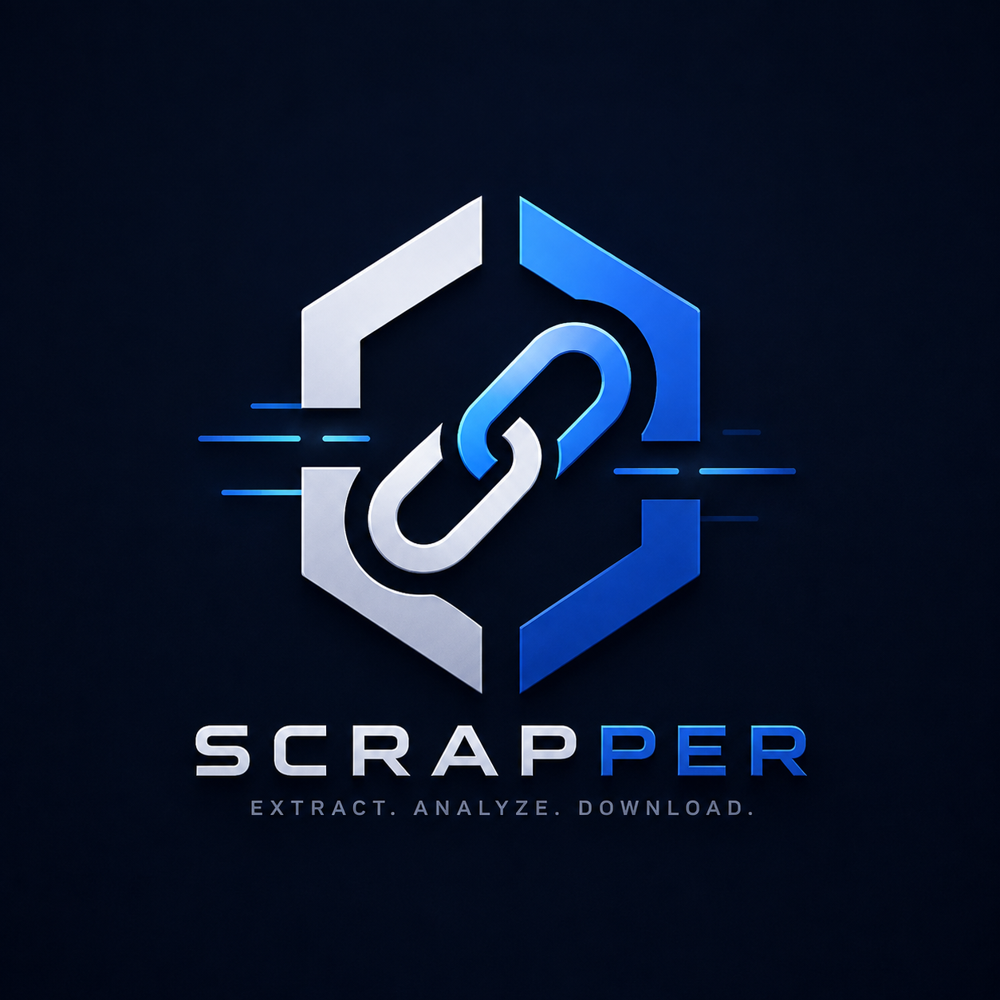

```markdown
<div align="center">
  
  
  # 🔍 Scrapper
  ### *Intelligent Data Extraction Platform*
  
  [](https://alifdiaz257-arch.github.io/scrapper)
  [](https://github.com/alifdiaz257-arch/scrapper)
  [](LICENSE)
  
  
  
  
</div>

---

## ✨ **Akses Cepat**

<div align="center">
  <a href="https://alifdiaz257-arch.github.io/scrapper">
    
  </a>
  <br><br>
  
  [](https://alifdiaz257-arch.github.io/scrapper)
  
  atau scan QR Code di bawah ini:
  
  
  
  **[🔗 https://alifdiaz257-arch.github.io/scrapper](https://alifdiaz257-arch.github.io/scrapper)**
</div>

---

## 🎯 **Fitur Unggulan**

<div align="center">
  <table style="border-collapse: collapse; border: none;">
    <tr>
      <td align="center" style="border: none; padding: 10px; background: #0D1117; border-radius: 8px;">⚡</td>
      <td align="left" style="border: none; padding: 10px; color: #E6EDF3;"><b>Ekstraksi Cepat</b> - Proses data dalam hitungan detik</td>
    </tr>
    <tr>
      <td align="center" style="border: none; padding: 10px; background: #0D1117; border-radius: 8px;">🎨</td>
      <td align="left" style="border: none; padding: 10px; color: #E6EDF3;"><b>UI Modern</b> - Antarmuka yang intuitif dan responsif</td>
    </tr>
    <tr>
      <td align="center" style="border: none; padding: 10px; background: #0D1117; border-radius: 8px;">🔄</td>
      <td align="left" style="border: none; padding: 10px; color: #E6EDF3;"><b>Real-time</b> - Update data secara langsung</td>
    </tr>
    <tr>
      <td align="center" style="border: none; padding: 10px; background: #0D1117; border-radius: 8px;">📊</td>
      <td align="left" style="border: none; padding: 10px; color: #E6EDF3;"><b>Multi-Format</b> - Support JSON, CSV, XML</td>
    </tr>
    <tr>
      <td align="center" style="border: none; padding: 10px; background: #0D1117; border-radius: 8px;">🔒</td>
      <td align="left" style="border: none; padding: 10px; color: #E6EDF3;"><b>Aman & Privasi</b> - Data tidak disimpan di server</td>
    </tr>
  </table>
</div>

---

## 🛠️ **Tech Stack**

<div align="center">
  
  
  
  
  
</div>

---

## 🚀 **Cara Menggunakan**

```bash
# Clone repositori
git clone https://github.com/alifdiaz257-arch/scrapper.git

# Masuk ke folder
cd scrapper

# Buka di browser
open index.html   # Mac
start index.html  # Windows
xdg-open index.html # Linux
```

Atau cukup kunjungi:
https://alifdiaz257-arch.github.io/scrapper

---

📸 Preview

<div align="center">
  

Tampilan antarmuka Scrapper

</div>

---

🤝 Kontribusi

<div align="center">

https://img.shields.io/badge/PRs-welcome-4FC3F7?style=for-the-badge&labelColor=0D1117
https://img.shields.io/badge/Open_Source-❤️-4FC3F7?style=for-the-badge&labelColor=0D1117

</div>

1. Fork repositori ini
2. Buat branch baru (git checkout -b fitur-keren)
3. Commit perubahan (git commit -m 'Tambahkan fitur keren')
4. Push ke branch (git push origin fitur-keren)
5. Buat Pull Request

---

📊 Statistik

<div align="center">
  
</div>

---

📝 Lisensi

<div align="center">

Copyright © 2024 Alif Diaz

Proyek ini dilisensikan di bawah MIT License - lihat file LICENSE untuk detail.

https://img.shields.io/badge/License-MIT-4FC3F7.svg?style=for-the-badge&labelColor=0D1117

</div>

---

💬 Kontak & Sosial Media

<div align="center">

https://img.shields.io/badge/GitHub-0D1117?style=for-the-badge&logo=github&logoColor=4FC3F7
https://img.shields.io/badge/Instagram-0D1117?style=for-the-badge&logo=instagram&logoColor=4FC3F7
https://img.shields.io/badge/LinkedIn-0D1117?style=for-the-badge&logo=linkedin&logoColor=4FC3F7
https://img.shields.io/badge/YouTube-0D1117?style=for-the-badge&logo=youtube&logoColor=4FC3F7

</div>

---

<div align="center">
  

  <br>

<b style="color: #4FC3F7;">Made with ❤️ by Alif Diaz</b>


https://img.shields.io/badge/⬆️_Back_to_Top-4FC3F7?style=for-the-badge&labelColor=0D1117

</div>
```
